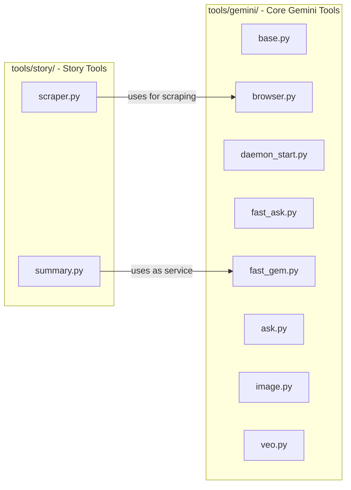

# Refactor Story Summary and Split Tool Groups

## Architecture




**Key change**: `story_summary.py` currently duplicates Gem interaction logic (send prompt, wait response, manage sessions). After refactoring, `tools/story/summary.py` will call `GeminiFastGem.run_fast()` directly as a service, reusing the existing "gem" tab and session management.

## 1. Split tools/ into two subpackages

**Current**: All files flat in `tools/`
**New structure**:

```
tools/
  __init__.py
  gemini/
    __init__.py
    base.py          (moved from tools/base.py)
    browser.py       (moved from tools/browser.py)
    daemon_start.py  (moved from tools/daemon_start.py)
    fast_ask.py      (moved from tools/fast_ask.py)
    fast_gem.py      (moved from tools/fast_gem.py)
    ask.py           (moved from tools/ask.py)
    image.py         (moved from tools/image.py)
    veo.py           (moved from tools/veo.py)
  story/
    __init__.py
    scraper.py       (scraping logic extracted from story_summary.py)
    summary.py       (orchestrator: scrape -> gem service -> save)
```

- Update all internal imports (e.g. `from tools.base import` becomes `from tools.gemini.base import`)
- Update all `bin/` scripts (e.g. `python -m tools.fast_ask` becomes `python -m tools.gemini.fast_ask`)
- Update `daemon_start.py` path references

## 2. Refactor story/summary.py to use GeminiFastGem as a service

Remove all duplicated Gem interaction code (`_send_long_text`, `_wait_for_summary`, `summarize_with_gem`, daemon management). Instead:

```python
from tools.gemini.fast_gem import GeminiFastGem

class StorySummary:
    def __init__(self, gem_id="dcca1e614968", quiet=False):
        self._gem = GeminiFastGem(quiet=quiet)
        self.gem_id = gem_id

    def get_summary(self, content: str) -> str | None:
        """Use ai-gem service to summarize content."""
        return self._gem.run_fast(prompt=content, gem_id=self.gem_id)
```

This reuses the "gem" role tab, session tracking (`gem_count`), and all speed optimizations from `fast_gem.py`.

## 3. Batch chapter scanning (from/to range)

Update CLI to accept a base URL + chapter range:

```bash
story-get-summary --from 1201 --to 1212 \
  "https://truyenfull.vision/pham-nhan-tu-tien-chi-tien-gioi-thien-pham-nhan-tu-tien-2/"
```

The `summary.py` will:

- Generate URLs: `{base_url}chuong-{N}/` for N in range
- Loop through each chapter: scrape -> summarize via gem service -> save
- Skip chapters that already have a summary file (resume support)

## 4. Slug filename format

Extract slug from the URL path. For `https://truyenfull.vision/pham-nhan-tu-tien-.../chuong-1201/`:

- Slug: `chuong-1201`
- Filename: `chuong-1201.txt`

The `_clean_title` method will be replaced with a `_slug_from_url(url)` function that parses the URL path segment.

## 5. Remove raw_content_story, keep only output_summary_story

- Remove `save_raw_content()` method and `RAW_CONTENT_DIR` constant
- Remove `raw_content_story/` from `.gitignore` (no longer needed)
- Only save to `output_summary_story/<slug>.txt`

## 6. Update bin/ scripts and imports

All `bin/` scripts need updated `python -m` paths:

- `ai-ask` -> `python -m tools.gemini.fast_ask`
- `ai-gem` -> `python -m tools.gemini.fast_gem`
- `ai-ask-debug` -> same pattern
- `ai-image` / `ai-veo` -> same pattern
- `ai-stop` -> `python -m tools.gemini.fast_ask --stop`
- `story-get-summary` -> `python -m tools.story.summary`

## 7. Test: scan chapters 1201-1212

After refactoring, run:

```bash
story-get-summary --from 1201 --to 1212 \
  "https://truyenfull.vision/pham-nhan-tu-tien-chi-tien-gioi-thien-pham-nhan-tu-tien-2/"
```

This will scrape 11 chapters and summarize each via the Gem, producing files `output_summary_story/chuong-1201.txt` through `chuong-1211.txt`.

## 8. Create Cursor agent rule

Create `.cursor/rules/retest-tools.mdc` with `alwaysApply: true` containing:

- How to verify the tools work after refactoring (import checks, CLI help, daemon start/stop)
- Standard test commands for each tool
- Expected file structure after refactoring
- How to run the story batch test

